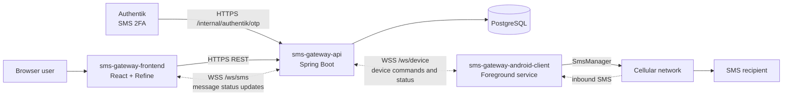
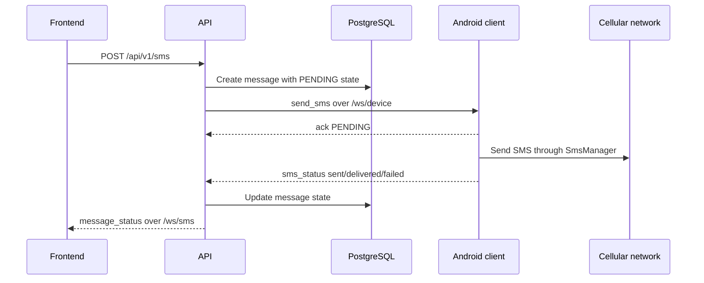

# SMS Gateway Demo

SMS Gateway Demo is a self-hosted SMS delivery stack. A React admin frontend sends SMS requests to a Spring Boot API, and the API delivers them through a real Android phone that keeps an outbound WebSocket connection open to the backend.

The project is split into three deployable modules:

- `sms-gateway-frontend` - React, Refine, Ant Design admin UI.
- `sms-gateway-api` - Kotlin/Spring Boot REST and WebSocket API.
- `sms-gateway-android-client` - Android client that sends and receives SMS using the phone radio.

The gateway is also designed for third-party consumption. External services can call the REST API with an `X-API-Key` header to send SMS messages or check number portability without using the admin frontend.

## Real-World Use Cases

An SMS gateway is useful when an application needs to deliver short, time-sensitive messages through a controlled channel:

- OTP and 2FA codes for login, account recovery, and sensitive actions.
- Banking-style transaction notifications, payment confirmations, and fraud alerts.
- Infrastructure and server alerts that need immediate human attention.
- Appointment reminders, delivery updates, and operational dispatch messages.
- Internal tools that need a simple API for sending SMS without integrating a cloud SMS provider.

For regulated or high-volume production systems, you still need to account for consent, local telecom rules, retention policies, rate limits, device reliability, and monitoring.

## Motivation

I built this mostly as a learning project and as a practical experiment in connecting an Android device to a backend over WebSockets. The idea was to use a real phone as the SMS transport while keeping the backend and frontend self-hosted.

The interesting part is the connection model: the phone opens an outbound WebSocket to the API, authenticates itself, stays online through a foreground service, receives `send_sms` commands, and sends delivery/inbound events back over the same socket. That avoids exposing the phone to the internet and makes the project a good end-to-end example of Android background services, WebSocket protocol design, REST APIs, and a browser admin UI working together.

## Architecture



Authentik SMS 2FA is supported through `POST /internal/authentik/otp`, protected by `AUTHENTIK_API_TOKEN`, so an identity provider can request OTP delivery through the same Android-backed SMS path.

For more detailed diagrams, see [docs/architecture.md](docs/architecture.md).

## Repository Layout

```text
sms-gateway-demo/
|-- sms-gateway-api/              # Kotlin/Spring Boot API
|-- sms-gateway-frontend/         # React admin frontend
|-- sms-gateway-android-client/   # Android SMS bridge app
`-- docs/                         # Architecture diagrams and notes
```

## Main Flow



## Quick Start

### API

Requirements: JDK 21 and PostgreSQL.

```powershell
cd sms-gateway-api
copy .env.example .env
# Load the variables from .env into your shell or deployment environment.
.\gradlew.bat bootRun
```

Important API settings are defined in `sms-gateway-api/.env.example` and `sms-gateway-api/src/main/resources/application.yml`.

### Frontend

Requirements: Node.js 20+ and npm.

```powershell
cd sms-gateway-frontend
npm install
$env:VITE_API_BASE_URL = "http://localhost:8080"
npm run dev
```

For local UI work without OIDC, use the included mock mode:

```powershell
npm run dev:mock
```

### Android Client

Requirements: Android Studio or an installed Gradle, JDK 17, and a physical Android phone with SMS capability.

```powershell
cd sms-gateway-android-client
gradle :app:assembleDebug
```

Install the app on the phone, grant SMS and notification permissions, then configure the backend URL and device API key in the app settings.

## Third-Party API Use

Create an API key from the frontend or directly through `POST /api/v1/api-keys`, then pass it to consumer applications as an `X-API-Key` header.

```http
POST /api/v1/sms
X-API-Key: <api-key>
Content-Type: application/json

{
  "phoneNumber": "+40712345678",
  "message": "Hello from an external service"
}
```

Useful integration endpoints:

| Endpoint | Purpose |
| --- | --- |
| `POST /api/v1/sms` | Send an SMS from a third-party service. |
| `POST /api/v1/sms/otp` | Send an OTP message using the configured template. |
| `GET /api/v1/sms` | Read message history for the API key owner. |
| `GET /api/v1/portability/{phoneNumber}` | Check current number portability data. |

## Runtime Configuration

### API Environment

| Variable | Purpose |
| --- | --- |
| `DATABASE_URL` | JDBC URL for PostgreSQL. |
| `DATABASE_USERNAME` | Database user. |
| `DATABASE_PASSWORD` | Database password. |
| `JWT_ISSUER_URI` | OIDC issuer used by the Spring resource server. |
| `SMS_GATEWAY_CORS_ALLOWED_ORIGINS` | Allowed browser origins, comma-separated. |
| `SMS_DEVICE_WS_SHARED_KEY` | Shared key accepted by `/ws/device` during the device handshake. |
| `SMS_DEVICE_WS_ACK_TIMEOUT` | Seconds to wait for an Android `ack` frame. |
| `SMS_OTP_TEMPLATE` | Optional OTP message template. Must include `{code}`. |
| `AUTHENTIK_API_TOKEN` | Optional static token for `/internal/authentik/otp`. |

### Frontend Environment

| Variable | Purpose |
| --- | --- |
| `VITE_API_BASE_URL` | Base URL of `sms-gateway-api`. |
| `VITE_OIDC_AUTHORITY` | OIDC authority for browser login. |
| `VITE_OIDC_CLIENT_ID` | OIDC client ID for PKCE login. |
| `VITE_MOCK` | Set to `true` to use mock auth and mock API during local UI work. |

## Security Notes

- The Android client opens an outbound WebSocket; the phone does not expose an inbound HTTP server.
- Production deployments should use HTTPS/WSS.
- SMS endpoints accept either a JWT with `sms_gateway_user` or `sms_gateway_admin`, or an API key that maps to `API_USER`.
- Admin endpoints require `sms_gateway_admin`.
- The Android app requests broad SMS permissions and should run only on a dedicated device you control.

## License

Licensed under the [PolyForm Noncommercial License 1.0.0](LICENSE). You may use, copy, modify, and distribute this project for non-commercial purposes. Commercial use is not permitted without separate written permission.
