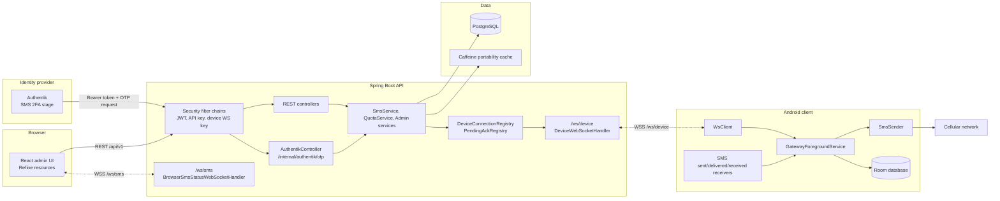
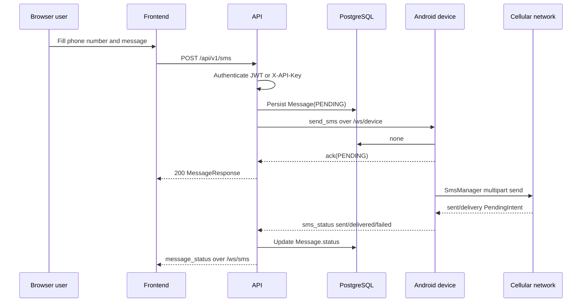
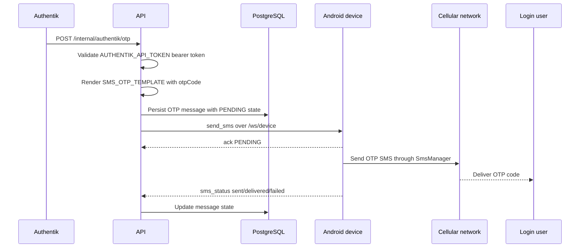
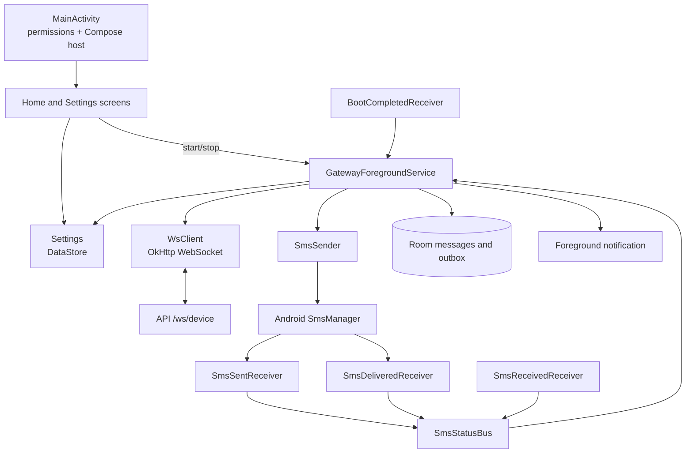
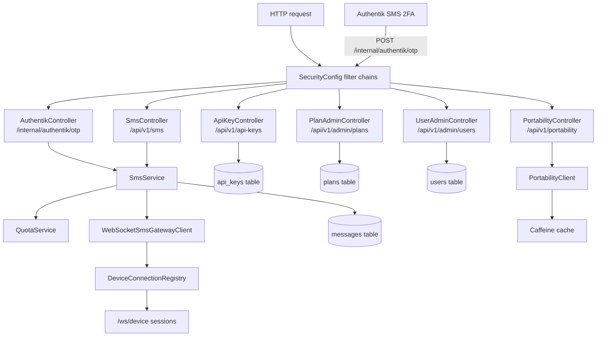
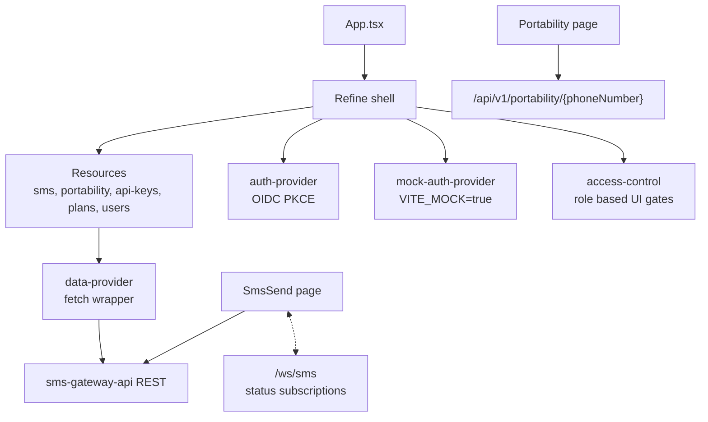

# Architecture

This document describes how the Android client, API, and frontend fit together. All diagrams are Mermaid diagrams and render directly on GitHub.

## System Overview

## SMS Send Sequence

## Authentik SMS 2FA Sequence

Authentik SMS 2FA uses the same delivery pipeline as normal SMS, but it enters through the internal `POST /internal/authentik/otp` endpoint. That endpoint is protected by the `AUTHENTIK_API_TOKEN` bearer token and sends the OTP body through `SmsService`.

## Android Client

The Android app stores its backend URL, API key, device ID, boot behavior, and inbound forwarding toggle in DataStore. The foreground service owns the WebSocket and keeps a local Room outbox so outbound frames can be replayed after reconnects.

## API

REST endpoints:

| Area | Endpoint | Auth |
| --- | --- | --- |
| Messages | `GET /api/v1/sms`, `POST /api/v1/sms`, `POST /api/v1/sms/otp` | JWT user/admin or `X-API-Key`. |
| API keys | `GET /api/v1/api-keys`, `POST /api/v1/api-keys`, `DELETE /api/v1/api-keys/{id}` | JWT user/admin. |
| Plans | `/api/v1/admin/plans` | JWT admin. |
| Users | `/api/v1/admin/users` | JWT admin. |
| Portability | `GET /api/v1/portability/{phoneNumber}` | JWT user/admin or `X-API-Key`. |
| Device WebSocket | `GET /ws/device` | Bearer `SMS_DEVICE_WS_SHARED_KEY` plus `X-Device-Id`. |
| Browser WebSocket | `GET /ws/sms?access_token=...` | JWT user/admin. |
| Authentik SMS 2FA | `POST /internal/authentik/otp` | Static bearer token from `AUTHENTIK_API_TOKEN`. |

## Frontend

The frontend uses `VITE_API_BASE_URL` for REST and derives WebSocket URLs from that same base URL. When `VITE_MOCK=true`, it uses the local mock auth provider and mock server for development.