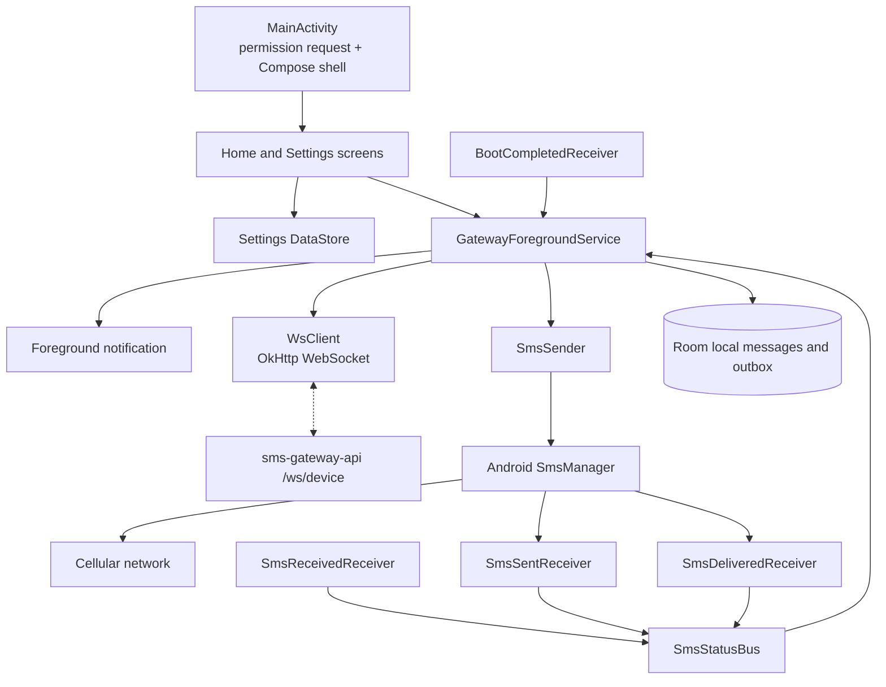

# SMS Gateway Android Client

Android companion app for SMS Gateway Demo. The app turns a dedicated Android phone into the SMS transport for the backend. The phone opens an outbound WebSocket to `sms-gateway-api`, receives `send_sms` commands, sends messages through Android `SmsManager`, and reports status events back to the API.

## Android Client Diagram



## WebSocket Protocol

Endpoint: `wss://<api-host>/ws/device`

Handshake headers:

- `Authorization: Bearer <SMS_DEVICE_WS_SHARED_KEY>`
- `X-Device-Id: <persisted-device-uuid>`

Frame types:

| Type | Direction | Purpose |
| --- | --- | --- |
| `device_register` | Device to API | Announces the device after connect. |
| `device_register_ack` | API to device | Accepts or rejects registration. |
| `send_sms` | API to device | Requests an outbound SMS. |
| `ack` | Device to API | Immediate queued acknowledgement. |
| `sms_status` | Device to API | Sent, delivered, or failed status. |
| `sms_received` | Device to API | Inbound SMS forwarding event. |
| `ping` / `pong` | Both directions | Application keepalive. |
| `error` | Both directions | Protocol or processing error. |

The protocol classes live in `app/src/main/java/ro/andreidev/sms/middleware/ws/WsProtocol.kt` and mirror the API DTOs in `sms-gateway-api/src/main/kotlin/ro/andreidev/sms/gateway/sms/ws/WsFrame.kt`.

## Build And Install

Requirements:

- Android Studio or an installed Gradle.
- JDK 17.
- A physical Android phone with SMS capability. Emulators cannot send real SMS.
- Backend reachable from the phone over HTTPS/WSS for production use.

The Android module does not include wrapper scripts, so open it in Android Studio or run it with an installed Gradle:

```powershell
cd sms-gateway-android-client
gradle :app:assembleDebug
```

Install the generated APK on the phone, grant SMS, phone-state, and notification permissions, then open Settings in the app and configure:

- Backend base URL, for example `https://sms.example.com`.
- Device API key matching `SMS_DEVICE_WS_SHARED_KEY` on the API.
- Device display name.
- Start on boot toggle.
- Forward inbound SMS toggle.

## Operational Notes

- The phone initiates the WebSocket, so no inbound port is needed on the device.
- `GatewayForegroundService` owns the socket and runs with a persistent notification.
- `SmsSender` supports multipart SMS and optional SIM slot selection.
- Outbound status and inbound SMS frames are persisted locally before being sent, then replayed after reconnect.
- For a dedicated gateway phone, disable battery optimization for this app.

## Security Notes

The app requests SMS permissions because it sends and receives messages. Use a dedicated device that you control, keep the backend behind TLS, and rotate the shared device key if the APK or phone is compromised.