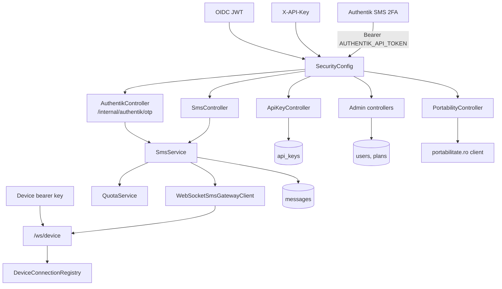

# SMS Gateway API

Kotlin/Spring Boot backend for the SMS Gateway Demo. It exposes REST endpoints for messages, API keys, plans, users, and portability lookup, plus WebSocket endpoints for Android devices and browser status updates.

## API Diagram



## Endpoints

| Area | Routes |
| --- | --- |
| Messages | `GET /api/v1/sms`, `POST /api/v1/sms`, `POST /api/v1/sms/otp` |
| API keys | `GET /api/v1/api-keys`, `POST /api/v1/api-keys`, `DELETE /api/v1/api-keys/{id}` |
| Plans | `GET/POST /api/v1/admin/plans`, `GET/PUT/DELETE /api/v1/admin/plans/{id}` |
| Users | `GET /api/v1/admin/users`, `GET /api/v1/admin/users/{id}`, `PUT /api/v1/admin/users/{id}/plan`, `DELETE /api/v1/admin/users/{id}/plan`, `PUT /api/v1/admin/users/{id}/enabled` |
| Portability | `GET /api/v1/portability/{phoneNumber}` |
| Device WebSocket | `/ws/device` |
| Browser status WebSocket | `/ws/sms` |
| Authentik SMS 2FA | `POST /internal/authentik/otp` |

## Third-Party Consumption

The API is intended to be consumed by external systems as well as the included frontend. Create an API key for the owning user, then call protected SMS and portability endpoints with `X-API-Key`.

```http
POST /api/v1/sms
X-API-Key: <api-key>
Content-Type: application/json

{
  "phoneNumber": "+40712345678",
  "message": "Hello from an external service"
}
```

API-key consumers can use `POST /api/v1/sms`, `POST /api/v1/sms/otp`, `GET /api/v1/sms`, and `GET /api/v1/portability/{phoneNumber}`.

Authentik SMS 2FA integrations use `POST /internal/authentik/otp` with a bearer token matching `AUTHENTIK_API_TOKEN`. The API renders the configured `SMS_OTP_TEMPLATE` and routes the OTP through the same Android WebSocket SMS pipeline.

## Configuration

The public configuration prefix is `sms-gateway`.

| Variable | Maps to | Purpose |
| --- | --- | --- |
| `DATABASE_URL` | `spring.datasource.url` | PostgreSQL JDBC URL. |
| `DATABASE_USERNAME` | `spring.datasource.username` | PostgreSQL user. |
| `DATABASE_PASSWORD` | `spring.datasource.password` | PostgreSQL password. |
| `JWT_ISSUER_URI` | `spring.security.oauth2.resourceserver.jwt.issuer-uri` | OIDC issuer. |
| `SMS_GATEWAY_CORS_ALLOWED_ORIGINS` | `sms-gateway.cors.allowed-origins` | Browser origins. |
| `SMS_DEVICE_WS_SHARED_KEY` | `sms-gateway.device-ws.shared-key` | Android WebSocket shared key. |
| `SMS_DEVICE_WS_ACK_TIMEOUT` | `sms-gateway.device-ws.ack-timeout-seconds` | Ack timeout in seconds. |
| `SMS_OTP_TEMPLATE` | `sms-gateway.otp-template` | OTP template with `{code}` placeholder. |
| `AUTHENTIK_API_TOKEN` | `sms-gateway.authentik.token` | Static token for the optional internal OTP endpoint. |

See `.env.example` for a starter set.

## Run Locally

```powershell
cd sms-gateway-api
copy .env.example .env
# Export the variables from .env into your shell, then run:
.\gradlew.bat bootRun
```

The app targets Java 21 and uses PostgreSQL. Hibernate `ddl-auto` is currently `update`, with Flyway present but disabled in `application.yml`.

## Roles

- `sms_gateway_user` can manage own API keys and send/check SMS resources.
- `sms_gateway_admin` can manage plans and users.
- `API_USER` is assigned by the API key filter for machine-to-machine requests.
