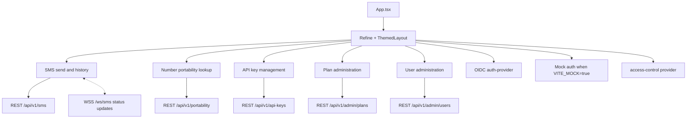

# SMS Gateway Frontend

React admin frontend for SMS Gateway Demo. It uses Refine, React Router, Ant Design, an OIDC auth provider, and a small custom data provider that talks to `sms-gateway-api`.

## Frontend Diagram



## Environment

| Variable | Purpose |
| --- | --- |
| `VITE_API_BASE_URL` | Base URL for `sms-gateway-api`, for example `http://localhost:8080`. |
| `VITE_OIDC_AUTHORITY` | OIDC authority for PKCE login. |
| `VITE_OIDC_CLIENT_ID` | OIDC client ID. |
| `VITE_MOCK` | Set to `true` to use local mock auth and mock API data. |

## Run Locally

```powershell
cd sms-gateway-frontend
npm install
$env:VITE_API_BASE_URL = "http://localhost:8080"
npm run dev
```

Mock mode:

```powershell
npm run dev:mock
```

Production build:

```powershell
npm run build
```

## Main Screens

- SMS send form with message history and live status updates over `/ws/sms`.
- Number portability lookup backed by `/api/v1/portability/{phoneNumber}`.
- API key list/create/revoke screens.
- Admin plan and user management screens gated by roles.